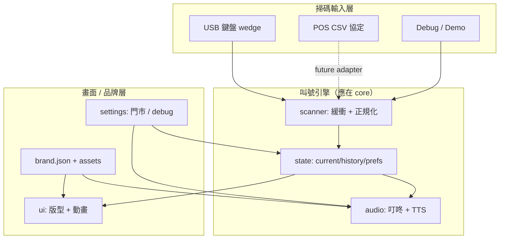

# 叫號引擎比對：三個 GitHub 專案 vs qms-platform

> 分析日期：2026-09-19  
> 分析者：UltronService  
> 方法：`gh` / `git clone --depth 1` 讀碼，對照本 repo `core/` 模組邊界  
> 限制：僅文件，不改業務功能；不動 Firebase

---

## 1. 什麼是「叫號引擎」？

本文件所稱 **叫號引擎**，指「掃碼／輸入 → 狀態更新 → 播號／聲音 → 畫面呈現」中，**與品牌外觀無關、可重用的核心邏輯**。

| 能力 | 引擎通常負責 | 畫面／品牌通常負責 |
| --- | --- | --- |
| 狀態 | 目前號碼、歷史、偏好、持久化 | 字體大小、動畫、版型 |
| 掃碼輸入 | 鍵盤 wedge 緩衝、正規化、Enter 觸發 | Debug 面板 UI、Demo 按鈕 |
| 播號／聲音 | 叮咚 + TTS 規則、靜音、失敗狀態 | 音效 badge、取餐文案 |
| 邊界 | 對外 API（subscribe / applyCall） | logo、菜單圖、輪播、天氣 |

---

## 2. 總覽對照表

| 維度 | Smart-Queue-Display-System | Restaurant-QMS-Display | guiji-qms-menu | **qms-platform（公版）** |
| --- | --- | --- | --- | --- |
| **Repo** | AaronKuan/Smart-Queue-Display-System | AaronKuan/Restaurant-QMS-Display | UltronService/guiji-qms-menu | UltronService/qms-platform |
| **技術棧** | React 19 + TS + Vite | React 19 + TS + Vite + Motion | 單檔 `index.html`（另有未接線 `js/`） | 原生 JS 模組 `core/*.js` |
| **引擎是否獨立** | ❌ 全在 `App.tsx` | ⚠️ `useQueue` 等 hooks，仍與 UI 同 repo | ⚠️ 邏輯在 inline JS；`js/` 模組化未完成 | ✅ `state/scanner/audio/ui/settings` 分檔 |
| **狀態模型** | 多筆 `Order[]`（含 type/status） | `current` + `history[]` + 未用 `pending` | 1 個主號 + 歷史陣列 | `current` + `history[]` + `prefs` + ids |
| **持久化** | ❌ 無（刷新即清空） | ❌ 刻意清除 legacy key | ✅ 多個 localStorage key | ✅ `qms_state_v1` + legacy 遷移 |
| **掃碼格式** | CSV：`號碼,類型,狀態` | CSV：`號碼,類型,狀態` | 純號碼（3 位 pad / mod 1000） | 純號碼（同 guiji 正規化） |
| **聲音** | TTS only（READY 時） | ❌ 無 | 叮咚 + TTS | 叮咚 + TTS + 失敗 badge |
| **重掃同號** | 依 status  upsert | 非 ready 時可能移除 | 重播音效、不變狀態 | `repeat` 事件，重播音效 |
| **自動逾時** | ❌ | ✅ 20s 移 history、120s 淡化 | ❌ | ❌ |
| **多訂單類型** | ✅ 6 種（內用/外帶/外送平台） | ✅ 儲存 type，UI 顯示 badge | ❌ 僅號碼 | ❌ Phase 1 僅號碼 |
| **品牌包** | ❌ 硬編碼 constants | ❌ 硬編碼 Tailwind / 圖片 | ⚠️ 龜記專用 inline | ✅ `brands/<id>/brand.json` |
| **Kiosk 適配** | 一般 web | WebView focus trap、capture 掃碼 | viewport scale | production/debug 分級 + Android shell |

---

## 3. 各專案詳細分析

### 3.1 Smart-Queue-Display-System

**定位：** AI Studio 原型，雙欄「製作中 / 請取餐」看板，展示 POS 掃碼整合概念。

**架構：**

```
App.tsx（引擎 + 版面 + Demo 全混在一起）
├── types.ts          → Order / OrderType / OrderStatus
├── constants.ts      → 類型標籤、icon、Tailwind 色
└── components/
    ├── Header.tsx    → 品牌標題、時鐘（純 UI）
    └── OrderCard.tsx → 卡片（純 UI）
```

**狀態：**

- `useState<Order[]>` 記憶體陣列，**無 localStorage**。
- 掃碼 CSV `{Pickup_Number},{Order_Type},{Status}`：
  - `status=0` → 從列表移除（已完成）
  - 其他 → upsert，更新 `timestamp`
  - 轉入 `READY(3)` → 觸發 TTS
- 衍生：`readyOrders`、`preparingOrders`（依 status 篩選 + 時間排序）

**掃碼：**

- 全域 `keydown`，2 秒 idle 清 buffer，Enter 提交。
- 聚焦 `<input>` 時忽略（Demo 面板可手動 `processInput`）。

**聲音：**

- 僅 `speechSynthesis`，模板：`請號碼 ${number} 的顧客到櫃檯取餐`。
- 無叮咚、無靜音開關、無重掃重播策略（READY 轉換才播）。

**引擎 vs 畫面邊界：**

| 引擎（邏輯在 App.tsx） | 畫面／品牌 |
| --- | --- |
| CSV 解析、訂單 CRUD | Header 標題、Smart Queue 字樣 |
| 雙看板分區規則 | OrderCard 樣式、constants 配色 |
| 鍵盤 wedge | index.html 暗色主題、動畫 |
| TTS 觸發（READY） | 區塊標題、空狀態文案 |

**小結：** 適合展示「多狀態、多類型訂單」的 POS 協定，但 **沒有抽出引擎、沒有持久化、沒有單一主號模型**，與 kiosk 單號大字看板路線不同。

---

### 3.2 Restaurant-QMS-Display

**定位：** 橫式 kiosk 數位看板（65% 輪播 + 35% 取餐牆），針對 Android WebView 舊版 Chromium 優化。

**架構：**

```
src/hooks/
├── useQueue.ts              → 核心狀態機
├── useBarcodeScanner.ts     → 鍵盤 wedge（capture、500ms timeout）
├── useWebViewKioskFocus.ts  → 隱藏 input 搶 focus（WebView 相容）
├── useDemoSimulation.ts     → 合成 CSV 測試
└── useMetricsLogger.ts      → localStorage 日誌（未接線）

src/App.tsx                  → 組裝 + 版面 + 輪播 + 分頁
src/components/Widgets.tsx   → OrderTypeBadge、ClockWidget
```

**狀態：**

```typescript
{ current: QueueItem | null, history: QueueItem[], pending: QueueItem[] }
```

- CSV `{orderNumber},{orderType},{orderStatus}`：
  - `status !== '0'` → 叫號（推 current，舊 current 進 history）
  - `status === '0'` → 取餐完成（從 current/history/pending 移除）
- **自動生命週期：**
  - current 顯示 **20 秒** → 自動移入 history
  - history 項目 **120 秒** → `uiState: 'inactive'`（淡化）
- history 上限 100；`pending` **從未寫入**（預留欄位）
- 啟動時 **刪除** legacy `qms_queue_state`，不持久化

**掃碼：**

- `document` capture phase，500ms 字元間隔，128 字元 buffer 上限。
- 搭配 WebView focus trap，確保掃碼槍事件進 JS。

**聲音：**

- **完全沒有** TTS / 音效；Bell 圖示僅裝飾。

**引擎 vs 畫面邊界：**

| 引擎（hooks） | 畫面／品牌 |
| --- | --- |
| CSV 解析、叫號／完成規則 | Hero 輪播圖、天氣 placeholder |
| 20s / 120s 計時 | Motion 動畫、3×5 history 分頁 |
| 掃碼 + WebView focus | OrderType 圖示對照表 |
| Demo 合成掃碼 | 雙語標籤、版本字串 |

**小結：** **掃碼協定與生命週期計時** 最完整，但模型是「多筆訂單 + 類型 + 完成狀態」，且 **無聲音、無持久化**。與公版「單主號 + 歷史 + 音效」是不同產品形態。

---

### 3.3 guiji-qms-menu（龜記直式菜單叫號）

**定位：** 龜記門市 Phase 0 單品牌 kiosk：15% 叫號 banner + 85% 菜單圖。

**架構（實際執行 vs 重構中）：**

| 路徑 | 狀態 | 說明 |
| --- | --- | --- |
| `index.html` inline JS | ✅ **線上版** | ~580 行，引擎+UI+debug 全在內 |
| `js/app.js` + `scanner.js` + `audio.js` + `ui.js` | ⚠️ **未接線** | 模組化草稿，DOM id 與 index 不一致 |

**狀態（線上版）：**

- `currentMain`（字串，`"---"` = 待機）+ `historyList`（最多 **2** 筆）
- `processScan()` 規則：
  1. 正規化：trim/uppercase；純數字 → 3 位 pad、`>999` → `% 1000`
  2. 待機喚醒：先移除 standby class，延遲 500ms 再顯示
  3. **重掃同號** → 只重播音效
  4. 新號：舊主號推入 history，從 history 移除重複，trim 上限
- **localStorage keys：**
  - `guiji_main_number`、`guiji_history`、`guiji_history_layout`
  - `guiji_font_pref`、`guiji_banner_opacity`
- 模組版另用 `GUIJI_QMS_CALLING_DATA_V2`（JSON 單 key），**與線上版 schema 不一致**

**掃碼：**

- 100ms 字元 timeout，Enter 觸發，`T` 開 debug。
- 模組 `BarcodeScanner` 用 capture phase（線上版為 bubble）。

**聲音：**

- Web Audio 雙音叮咚（E5 + C5）→ `speechSynthesis`「請，{號碼}，取餐」
- `isMuted` 記憶體旗標（**未持久化**）
- 重掃同號會 `triggerEffects()` 重播

**引擎 vs 畫面邊界：**

| 引擎（processScan / triggerEffects） | 畫面／品牌 |
| --- | --- |
| 主號 + 歷史狀態機 | 龜記 logo、綠色 overlay、遠端 video URL |
| 號碼正規化 | 15/85 版型、history 動畫 preset |
| 持久化（號碼/歷史/偏好） | `#menu-area` 靜態菜單圖 |
| 叮咚 + TTS | debug 面板（字體/透明度/動畫 slider） |

**小結：** 與 **qms-platform 血緣最近**——單主號模型、號碼正規化、叮咚+TTS、重掃重播。缺點是 **單檔 monolith**、模組化未完成、storage key 分裂。

---

### 3.4 qms-platform（本 repo 公版）

**定位：** core + brand pack + multi-brand URL，Phase 1 靜態 Web + Android shell 骨架。

**模組邊界：**

```
core/
├── state.js      → createStateStore、applyCall、legacy 遷移
├── scanner.js    → normalizeBarcode、createScanner
├── audio.js      → createAudioManager（叮咚+TTS+失敗狀態）
├── ui.js         → createUi（portrait-menu / landscape-queue）
├── settings.js   → 門市靜音、production/debug 分級
├── brand-loader.js
└── app.js        → boot 組裝：store → scanner → audio → ui
```

**狀態（`qms_state_v1`）：**

```javascript
{
  version: 1,
  current: string | null,      // null = 待機（非 "---" 魔術字）
  history: string[],
  prefs: { historyOrientation, bannerOpacity, muted, font },
  storeId, deviceId,
  updatedAt
}
```

- `applyCall(code, historyMax)` → `ignored` | `repeat` | `call`
- **Legacy 遷移：** `guiji_qms_state_v1`、`GUIJI_QMS_CALLING_DATA_V2`、分散的 `guiji_*` keys
- subscribe 事件：`call` | `repeat` | `clear` | `prefs` | `ids`

**掃碼：**

- 100ms timeout（同 guiji），capture phase，Enter 觸發。
- 正規化邏輯與 guiji 線上版一致。

**聲音：**

- 叮咚 + TTS（品牌 `copy.pickupHint`）
- 靜音寫入 `prefs.muted` 並持久化
- `ttsFailed` / `dingDongFailed` → UI badge
- 首次 click/keydown `unlock()` AudioContext

**引擎 vs 畫面邊界：**

| 引擎（core） | 品牌包（brands/） |
| --- | --- |
| 狀態機、持久化、遷移 | theme、copy、queue 設定 |
| 掃碼正規化 | assets（logo/menu/video） |
| 音效管線 | layout 開關（portrait / landscape） |
| 待機/叫號 class 切換邏輯 | 顯示名稱、storeId 預填 |
| production/debug 行為 | 不修改 core |

**與 guiji-qms-menu 對照：**

| 項目 | guiji 線上 | qms-platform |
| --- | --- | --- |
| 待機表示 | `"---"` 字串 | `current: null` |
| history 預設上限 | 2（brand 可 3） | brand.json `historyMax` |
| 靜音持久化 | ❌ | ✅ prefs.muted |
| 模組化 | monolith | ✅ 分檔 + 單元測試 |
| 多品牌 | ❌ | ✅ brand pack |
| 橫式版型 | ❌ | ✅ landscape-queue |

---

## 4. 掃碼協定差異（整合 POS 時最關鍵）

| 專案 | 輸入格式 | 語意 |
| --- | --- | --- |
| Smart-Queue | `168,1,3` | 168 號、內用、READY → 上取餐板 + TTS |
| Restaurant-QMS | `168,1,1` | 168 號、內用、ready → 叫號；`,1,0` → 取走 |
| guiji / qms-platform | `088` 或 `A01` | 純號碼 → 推進主號／歷史 |
| qms-platform（若未來擴充） | 可新增 adapter | 建議 **不** 把 CSV 解析塞進 state.js |

**建議：** POS 整合層（future `core/adapters/pos-csv.js` 或 shell 注入）負責 CSV → `applyCall()`，引擎核心維持「純號碼」不變。

---

## 5. 持久化 key 對照

| Key | 專案 | 內容 |
| --- | --- | --- |
| （無） | Smart-Queue | — |
| `qms_queue_state` | Restaurant-QMS | 僅 **刪除**，不寫入 |
| `qms_logs` / `qms_heartbeat` | Restaurant-QMS | metrics hook（未用） |
| `guiji_main_number` 等 | guiji 線上 | 分散 keys |
| `GUIJI_QMS_CALLING_DATA_V2` | guiji 模組版 | 單 JSON |
| `guiji_qms_state_v1` | guiji 統一版（規格） | 過渡 schema |
| **`qms_state_v1`** | **qms-platform** | **正式公版 key** |

公版 `state.js` 已實作從 guiji 全系統 key 的 **一次性遷移**，降低龜記門市升級風險。

---

## 6. 引擎邊界成熟度評分

| 評分項 | Smart-Queue | Restaurant-QMS | guiji-qms-menu | qms-platform |
| --- | --- | --- | --- | --- |
| 模組分離 | ⭐ | ⭐⭐ | ⭐⭐（草稿） | ⭐⭐⭐⭐ |
| 狀態可測性 | ⭐ | ⭐⭐ | ⭐ | ⭐⭐⭐⭐（node:test） |
| 持久化 | — | — | ⭐⭐⭐ | ⭐⭐⭐⭐ |
| 音效完整度 | ⭐⭐ | — | ⭐⭐⭐ | ⭐⭐⭐⭐ |
| POS 協定 | ⭐⭐⭐⭐ | ⭐⭐⭐⭐ | ⭐ | ⭐（Phase 1 純號碼） |
| 多品牌 | — | — | — | ⭐⭐⭐⭐ |
| Kiosk 實戰 | ⭐⭐ | ⭐⭐⭐⭐ | ⭐⭐⭐ | ⭐⭐⭐ |

---

## 7. 公版引擎建議：保留 vs 吸收

### 7.1 建議 **保留**（qms-platform 已做對）

1. **core 模組分離**：`state / scanner / audio / ui / settings / app.boot`
2. **單主號 + 歷史** 模型與 `applyCall` 三態（ignored / repeat / call）
3. **號碼正規化**（3 位 pad、mod 1000、英數保留）—— 與 guiji 線上一致
4. **叮咚 + TTS + 靜音持久化 + 失敗 badge**
5. **重掃同號重播音效**（`repeat` 事件）
6. **`qms_state_v1` + legacy 遷移**
7. **brand pack** 驅動 layout / theme / copy / historyMax
8. **production / debug 分級**（正式包關 T/Demo，門市長按靜音）
9. **單元測試** 覆蓋 state、scanner、brand 驗證

### 7.2 建議 **吸收**（選配，不阻塞 Phase 1）

| 來源 | 能力 | 吸收方式 | 優先級 |
| --- | --- | --- | --- |
| Restaurant-QMS | WebView focus trap | 移入 `core/scanner.js` 或 `shell/android` 可選 hook | 高（Android kiosk） |
| Restaurant-QMS | capture phase 掃碼 | 公版 scanner 可改預設 capture | 中 |
| Restaurant-QMS | 20s / 120s 自動移 history | 新增 **opt-in** `queue.autoExpireMs` in brand.json | 低（需 PM 確認） |
| Restaurant-QMS | CSV POS adapter | 獨立 adapter 模組，輸出 `applyCall()` | 中（多 POS 時） |
| Smart-Queue | 多訂單類型 enum | 擴充 state 或 parallel `orders[]` 模式 | 低（不同產品線） |
| Smart-Queue | READY 才 TTS | 若接 CSV，在 adapter 層決定是否 call | 低 |
| guiji 線上 | history 進出場動畫 | 保留在 `ui.js` CSS，不進 state | 中（品牌差異化） |
| guiji 線上 | 待機 500ms 延遲 | 可作 ui 動畫選項 | 低 |
| guiji 模組 | scan toast | debug 模式可選 | 低 |
| Restaurant-QMS | useMetricsLogger | 診斷包 / shell 注入，不進 core 預設 | 低 |

### 7.3 建議 **不吸收**

1. **Smart-Queue 無持久化** — kiosk 斷電恢復是剛性需求
2. **Restaurant-QMS 無音效** — 龜記場域已驗證要叮咚+TTS
3. **guiji monolith 單檔結構** — 已重構成 core
4. **分散 localStorage keys** — 統一 `qms_state_v1`
5. **`"---"` 魔術字串** — 公版改用 `current: null` 語意更清楚
6. **Firebase / 後端同步** — Phase 1 明確不動

---

## 8. 架構關係圖



---

## 9. 參考檔案索引

### Smart-Queue-Display-System

- `App.tsx` — 引擎 + UI  monolith
- `types.ts` — Order / OrderStatus / OrderType
- `constants.ts` — 類型顯示對照

### Restaurant-QMS-Display

- `src/hooks/useQueue.ts` — 狀態機
- `src/hooks/useBarcodeScanner.ts` — 掃碼
- `src/hooks/useWebViewKioskFocus.ts` — WebView focus
- `src/App.tsx` — 組裝與版面

### guiji-qms-menu

- `index.html` — **線上引擎**（processScan / triggerEffects）
- `js/app.js`, `js/scanner.js`, `js/audio.js`, `js/ui.js` — 模組草稿

### qms-platform

- `core/state.js` — 狀態 store 與遷移
- `core/scanner.js` — 掃碼
- `core/audio.js` — 音效
- `core/ui.js` — 畫面
- `core/app.js` — boot 組裝
- `core/tests/qms-core.test.js` — 單元測試
- `docs/overview.md` — core vs brand 原則

---

## 10. 結論（工程視角）

三個外部 repo 代表三條路線：

1. **Smart-Queue** — POS 多狀態看板原型，**無引擎邊界、無持久化**。
2. **Restaurant-QMS** — kiosk 橫式看板 + **CSV 協定 + 生命週期計時 + WebView 適配**，**無音效**。
3. **guiji-qms-menu** — 龜記直式 **單主號 + 音效 + 持久化**，但 **monolith**，為 qms-platform 的直接前身。

**qms-platform** 已將 guiji 能力 **模組化、多品牌化、測試化**，並統一 storage。後續若接 POS CSV 或 Android 強化，應以 **adapter / shell 插件** 擴充，避免再次把引擎與 UI 揉回單檔。
