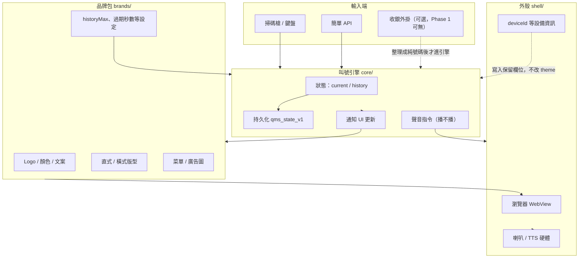
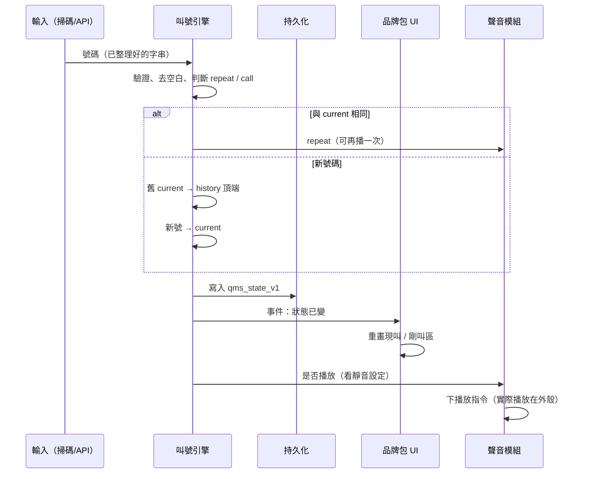
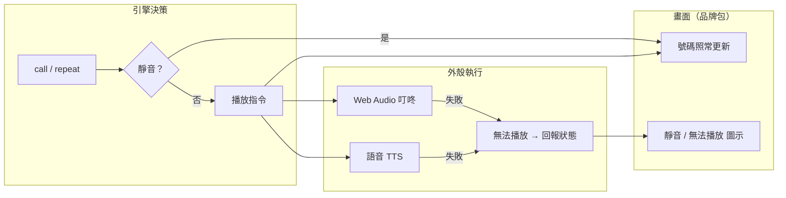
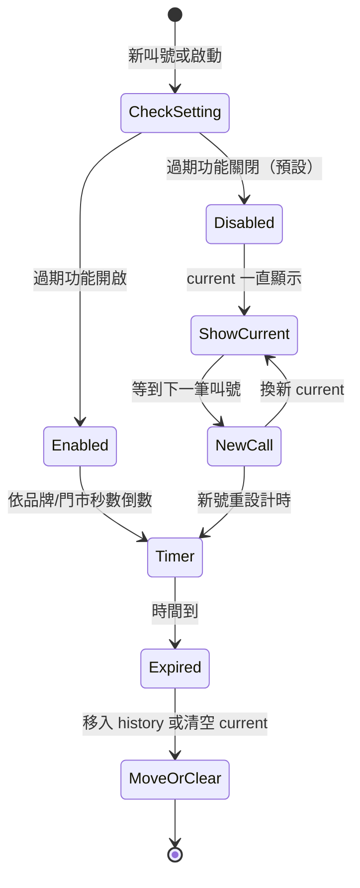
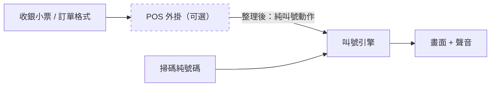
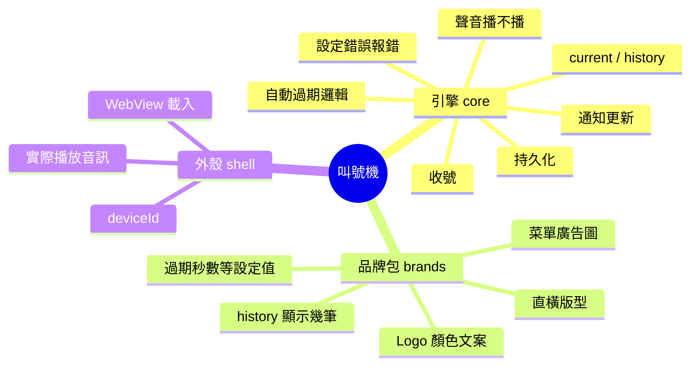

# 叫號引擎正式定稿 / Queue Engine Spec (Final)

> **Owner:** UltronService · **Status:** 正式定稿 · Phase 1 以本文件為準  
> 比對三專案現況見 [engine-comparison-three-repos.md](./engine-comparison-three-repos.md)（PR #6，獨立文件）。

---

## 目錄

1. [討論導讀](#討論導讀--discussion-guide)
2. [整體架構圖](#整體架構圖--architecture)
3. [叫號流程](#叫號流程--call-flow)
4. [聲音分工](#聲音分工--audio-split)
5. [自動過期](#自動過期流程--auto-expiry-flow)
6. [收銀外掛位置](#收銀外掛位置--pos-plugin)
7. [邊界：誰管什麼](#邊界誰管什麼--boundary)
8. [正式定稿五則](#1-引擎負責什麼--engine-responsibilities)
9. [名詞說明](#名詞說明--glossary)

---

## 討論導讀 / Discussion Guide

本文件分兩層：

| 層次 | 用途 | 讀者 |
| --- | --- | --- |
| **圖示＋名詞** | 開會對齊、跟 PM／門市／設計討論「誰做什麼」 | 全員 |
| **正式定稿五則** | 開發與驗收的唯一依據，**不可自行解讀成別的意思** | 工程、QA |

**建議討論方式：**

1. 先看 [整體架構圖](#整體架構圖--architecture)，確認「引擎／品牌包／外殼」三塊。
2. 依議題挑流程圖：叫號、聲音、過期、收銀。
3. 有歧義時查 [名詞說明](#名詞說明--glossary)，用同一個詞再討論。
4. 定案後以 [正式定稿五則](#1-引擎負責什麼--engine-responsibilities) 為準寫 ticket／驗收。

---

## 整體架構圖 / Architecture

叫號機 = **引擎（腦）** + **品牌包（皮）** + **外殼（殼）**。

**白話：** 客人或店員「給一個號」→ 引擎記住並通知畫面 → 品牌包決定長怎樣 → 外殼負責真的出聲。

---

## 叫號流程 / Call Flow

從「收到號碼」到「畫面更新」的標準路徑：

**討論重點：**

- 引擎**一定先改狀態、再通知 UI**；不能只有聲音沒畫面。
- **重整頁面**時從 `Store` 讀回，現叫／剛叫仍在（定稿 §1）。
- `history` 筆數上限由品牌包 `historyMax` 提供，但「要不要顯示幾格」是 UI 的事（定稿 §5）。

---

## 聲音分工 / Audio Split

**討論重點：**

- 「要不要出聲」= 引擎；「怎麼播出來」= 外殼／瀏覽器。
- 喇叭壞、瀏覽器擋自動播放 → **叫號不能停**，只多一個狀態提示（定稿 §3）。

---

## 自動過期流程 / Auto Expiry Flow

**討論重點：**

- **預設關閉**：多數門市希望號碼一直掛著直到下一單（定稿 §2）。
- 秒數誰定：**品牌包或門市設定**，引擎只執行，不幫忙選 UI 文案。

---

## 收銀外掛位置 / POS Plugin

Phase 1 核心不接收銀；外掛是「翻譯層」，可選。

**討論重點：**

- 外掛可以晚做；沒外掛時走左邊「掃碼純號碼」即可（定稿 §4）。
- 引擎 API **不要**綁特定收銀品牌語法，避免 core 被污染。

---

## 邊界：誰管什麼 / Boundary

| 議題 | 引擎 | 品牌包 | 外殼 |
| --- | :---: | :---: | :---: |
| 號碼對不對、記不記得住 | ✓ | | |
| 畫面配色、Logo | | ✓ | |
| 直式菜單 vs 橫式取餐牆 | | ✓ | |
| 叮咚 / TTS 真的播出 | | | ✓ |
| 靜音偏好存哪 | ✓（狀態） | ✓（預設值） | |
| Firebase 同步 | Phase 1 不動 | | |

---

## 1. 引擎負責什麼 / Engine Responsibilities

叫號引擎（`core/`）只做「叫號這件事」本身：

| 項目 | 白話 |
| --- | --- |
| **收下號碼** | 接收掃碼、鍵盤、API 等輸入，整理成可叫的號碼。 |
| **記住現叫／剛叫** | 維護 `current`（現正叫）與 `history`（剛叫過）；寫入持久化（如 `qms_state_v1`），**重整頁面或重開機後仍在**。 |
| **通知畫面更新** | 狀態變了要讓 UI 知道（事件／回呼），畫面由品牌包或外殼去畫。 |
| **設定錯誤要明白報錯** | 品牌包缺欄位、layout 不合法、狀態損壞等——**不要靜默失敗**，要給可讀的錯誤訊息。 |

---

## 2. 自動過期 / Auto Expiry

| 規則 | 說明 |
| --- | --- |
| **引擎要支援** | 現叫號碼可在一段時間後自動清掉或移入歷史（依產品定義）。 |
| **可關閉** | 門市／品牌可選不啟用。 |
| **預設關閉** | 新部署或未設定時，**不自動過期**。 |
| **關閉時** | 現叫一直顯示，直到**下一筆叫號**進來才換。 |
| **開啟時** | 過期秒數由**品牌包或門市設定**提供，引擎依設定執行。 |

---

## 3. 聲音 / Audio

| 角色 | 責任 |
| --- | --- |
| **引擎** | 依設定（靜音、偏好等）**決定該不該出聲**，並下達「播放叫號音」指令。 |
| **設備／外殼** | Android Kiosk、瀏覽器、喇叭硬體——**負責實際播出**（Web Audio、原生 TTS 等）。 |
| **無聲時** | **畫面仍要更新**叫號；UI 可顯示「靜音」或「無法播放」等狀態，不阻擋叫號流程。 |

---

## 4. 收銀翻譯 / POS Translation (Optional Plugin)

| 規則 | 說明 |
| --- | --- |
| **預留可選外掛** | 收銀系統格式（小票、訂單號）→ 叫號號碼，可用外掛轉譯。 |
| **第一版可不做** | Phase 1 不必實作 POS 對接。 |
| **核心只認整理後的叫號動作** | 引擎 API 只接受**已整理好的叫號／取餐號**，不內建各品牌收銀語法。 |
| **無對接時** | 輸入端只收**單純號碼**（掃碼、手 key、簡單 API）。 |

---

## 5. 引擎不負責 / Out of Scope

以下交給**品牌包**（`brands/<id>/`）或**外殼**（`shell/`），引擎不管：

- Logo、顏色、文案
- 直式／橫式版型（`portrait-menu` / `landscape-queue`）
- 歷史區顯示幾筆（`historyMax` 等）
- 菜單圖、廣告圖

---

## 名詞說明 / Glossary

| 名詞 | English | 白話解釋 |
| --- | --- | --- |
| **叫號引擎** | Queue Engine | `core/` 程式，負責號碼狀態與叫號邏輯，不管長相。 |
| **品牌包** | Brand Pack | `brands/<brandId>/`，含 `brand.json` 與素材，決定哪家店、什麼版型、什麼顏色。 |
| **外殼** | Shell | `shell/`，例如 Android Kiosk WebView，負責載入網頁、設備 ID、實際播音。 |
| **現叫** | Current | 現在正在叫、畫面最大那個號，`state.current`。 |
| **剛叫 / 歷史** | History | 剛叫過、還在牆上展示的號碼列表，`state.history`。 |
| **叫號動作** | Call Action | 引擎認得的輸入：新叫（call）、同號再叫（repeat）、無效忽略（ignored）。 |
| **持久化** | Persistence | 把狀態存起來（如 `localStorage` 的 `qms_state_v1`），重開還在。 |
| **repeat** | Repeat Call | 同一個 `current` 再叫一次，通常為了讓客人再聽一次。 |
| **historyMax** | History Max | 品牌包設定：引擎最多保留幾筆 history；**畫面顯示幾格**仍由 UI 決定。 |
| **自動過期** | Auto Expiry | 現叫顯示一段時間後自動清掉或移入 history；**預設關**。 |
| **靜音** | Muted | 不出聲設定；引擎不發播放指令，但號碼照常更新。 |
| **播放指令** | Play Command | 引擎告訴聲音模組「該播了」；實際波形／TTS 由外殼執行。 |
| **POS 外掛** | POS Plugin | 可選模組，把收銀格式翻成引擎能吃的純號碼或叫號動作。 |
| **layout** | Layout | 版型代號：`portrait-menu`（直式菜單）、`landscape-queue`（橫式取餐牆）。 |
| **prefs** | Preferences | 執行期偏好（如靜音、字體），存在 state 裡，與品牌預設可並存。 |
| **storeId / deviceId** | Store / Device ID | 門市、設備識別（保留欄位）；外殼可注入 `deviceId`，**不改品牌 theme**。 |
| **設定錯誤** | Config Error | 品牌包缺欄位、layout 不合法等；引擎須顯示可讀錯誤，不可靜默換品牌。 |
| **Phase 1** | Phase 1 | 目前階段：Web 靜態 demo + Android 殼骨架；**Firebase 不動**。 |

---

## 相關文件

- [overview.md](./overview.md) — 公版 vs 品牌包
- [brand-pack.schema.md](./brand-pack.schema.md) — 品牌包欄位
- [directory.md](./directory.md) — 目錄職責
